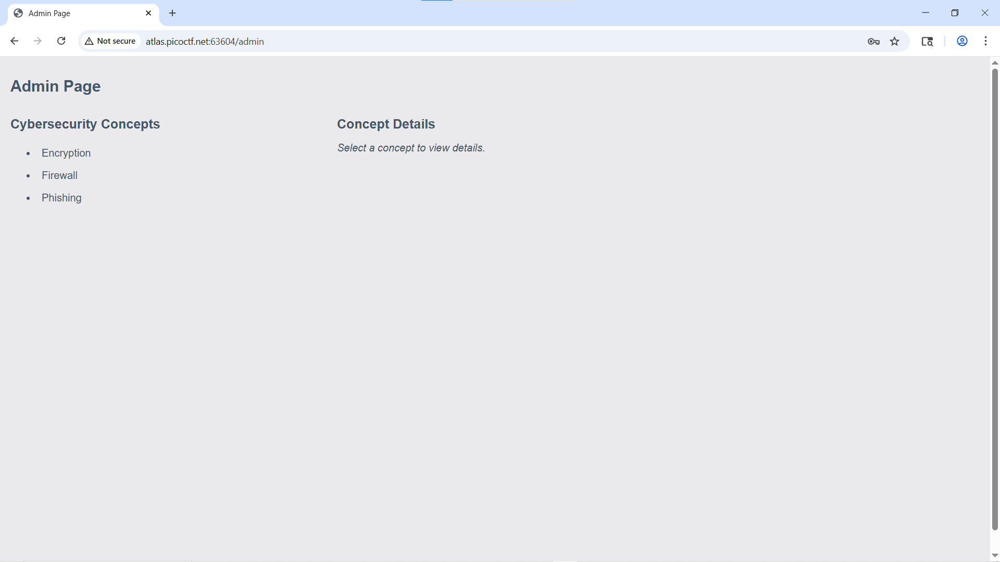
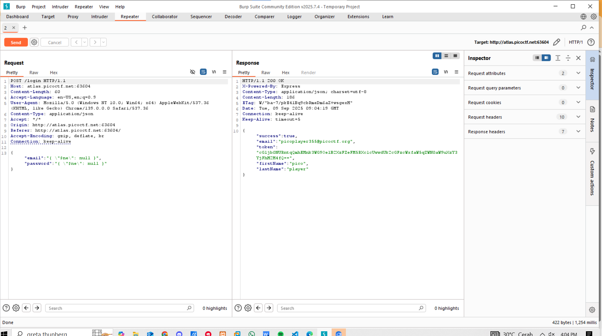
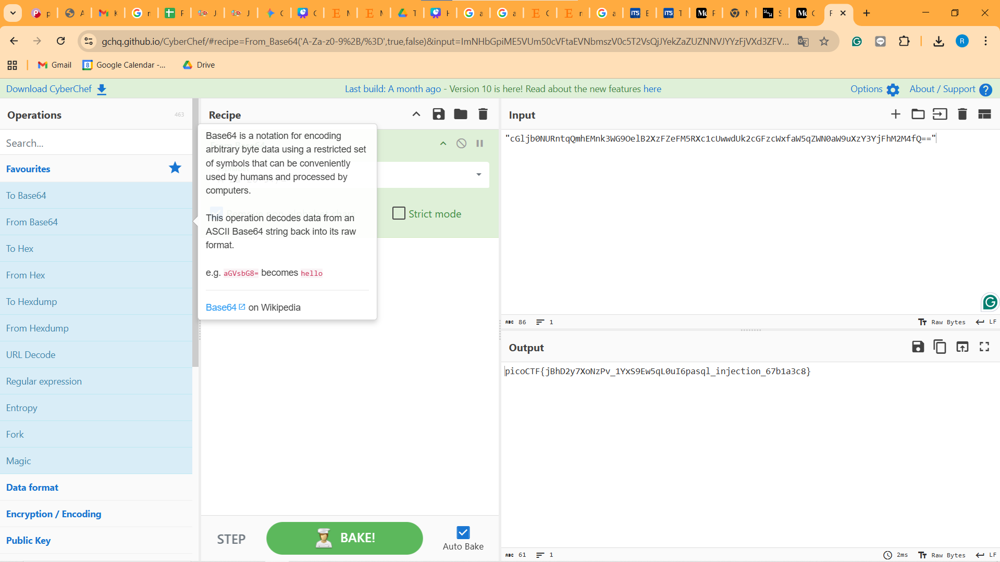

Find the Flag
https://play.picoctf.org/practice/challenge/443

Hal-hal yang saya lakukan: 
1. Mendownload file-file yang diberikan dan mengetahui menggunakan mongo DB dan mengetahui kelemahannya
2. Menggunakan payload { "$ne": null } untuk email dan passwordnya dan kita berhasil masuk namun tidak ada flag
3. Saya mencoba menggunakan burpsuit untuk melihat apakah ada flag yang diberikan pada token saat login 
4. Saya melihat token "cGljb0NURntqQmhEMnk3WG9OelB2XzFZeFM5RXc1cUwwdUk2cGFzcWxfaW5qZWN0aW9uXzY3YjFhM2M4fQ==" yang kemungkinan merupakan flagnya 
5. Ternyata benar bahwa itu adalah flag yang di enkripsi dengan base64 sehingga dengan menggunakan cypherchef saya mendapatkan flag picoCTF{jBhD2y7XoNzPv_1YxS9Ew5qL0uI6pasql_injection_67b1a3c8} 

Bukti 

#### Berhasil 