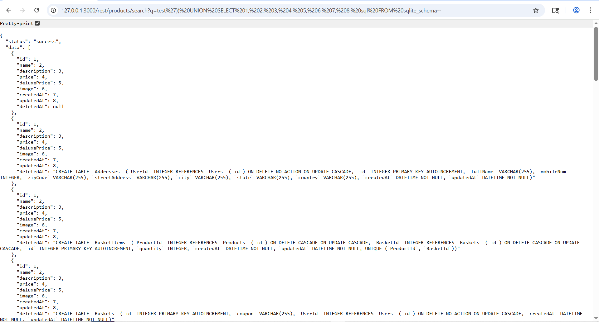

Exfiltrate the entire DB schema definition via SQL Injection.
https://juice-shop.herokuapp.com/#/score-board?categories=Injection 

Hal-hal yang dilakukan: 

1. Menemukan cara search pada juicy shop dengan menggunakan fungsi search yang tersedia
2. Ditemukan "127.0.0.1:3000/rest/products/search?q" adalah cara search  
3. Mengubah hal yang disearch menggunakan payload yang sudah dimodifikasi yaitu 
127.0.0.1:3000/rest/products/search?q=test'))    
4. Lalu kita akan mendapatkan schemanya 

Bukti 

#### Berhasil 