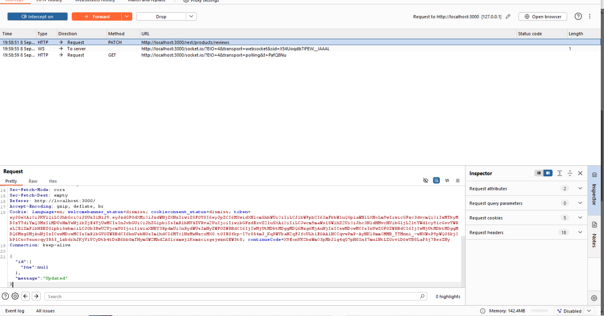
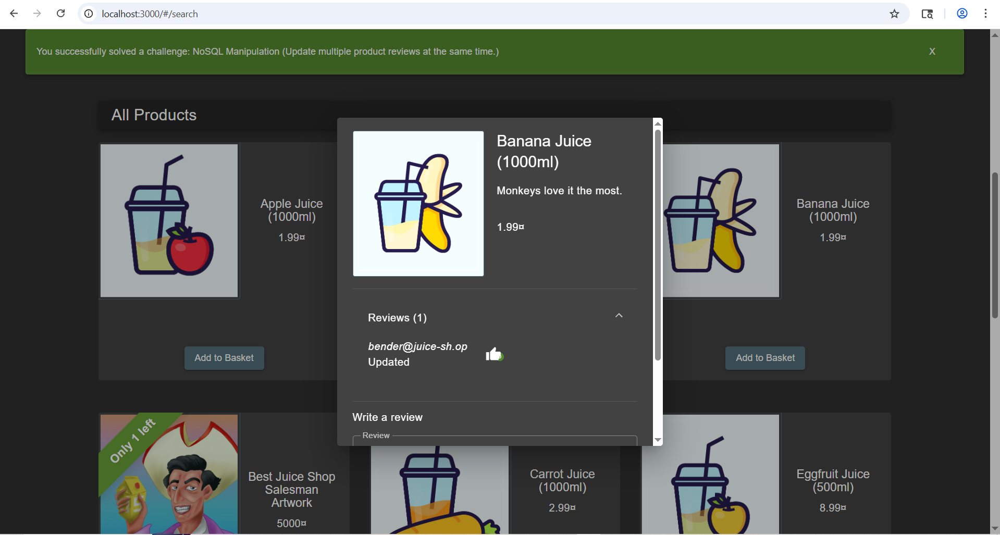

Update multiple product reviews at the same time. 
https://juice-shop.herokuapp.com/#/score-board?categories=Injection 

Hal-hal yang saya lakukan :
1. Melihat cara server memperbarui sebuah review dan didapatkan 
PATCH /rest/products/reviews HTTP/1.1
Host: 127.0.0.1:3000
Content-Type: application/json
___
___
{
  "id": "id dari yang direview",
  "message": "updated"
}
2. Karena dia mengupdated berdasarkan idnya maka kita bisa membuat sebuah payload yang akan mengcover semua id yang bukan null dengan {"$ne": null} 
3. Lalu kita hanya tinggal menngganti id yang direview dengan payloadnya maka semuanya akan berganti ke updated
4. Maka kita berhasil mengubah semua review dalam satu kali mengupdated. 

Bukti 

#### Berhasil 